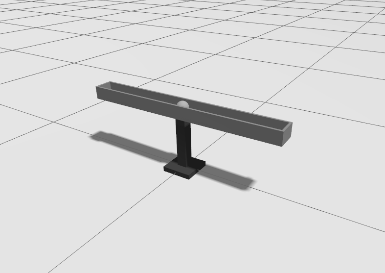

# Ball and Beam System Simulation

> The project was developed in the Intelligent Control course, with instruction and guidance from Professor Fábio Bento. The group members are: Daniel Prezotti Marchesi, Gustavo Delpupo Ribeiro, João Pedro Queiroz dos Santos e Luis Philipe Zioto de Barros.

This project involves building a Ball and Beam system in a gazebo, integrating **ROS** concepts for environment and robot management and construction using the Xacro tool, and editing `.urdf` files.

More informations about Gazebo/Xacro: [Gazebo](https://classic.gazerialsbosim.org/tuto/?tut=ros_urdf).

# Environment
Below, we present an image of the developed environment.

  

