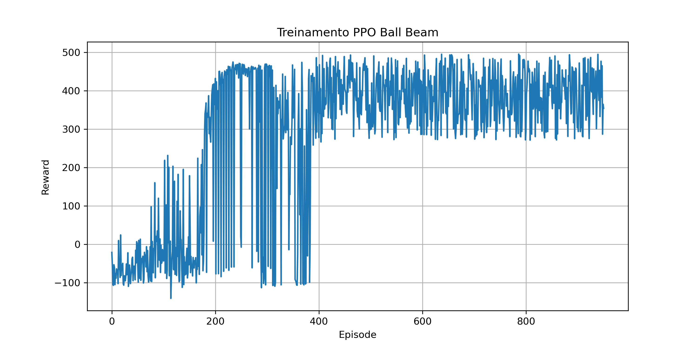

# Architecture

The file layout for this project is below.

```bash
src/
├── ball_beam_rl/
│   ├── ball_beam_rl/
│   │   ├── __init__.py
│   │   ├── ball_state_node.py
│   │   ├── gym_env.py
│   │   ├── simulation.py
│   │   └── train.py
│   │
│   ├── config/
│   │   └── controllers.yaml
│   │
│   └── launch/
│   │   └── ball_beam_launch.py
│   │
│   └── resource/
│   │   └── ball_beam_rl
│   │
│   └── urdf/
│   │   ├── ball.urdf
│   │   └── ball_beam.xacro
│   │
│   └── worlds/
│   │   └── empty.world
│   │
│   ├── package.xml
│   ├── setup.cfg
│   └── setup.py
│
├── ppo_ball_beam.zip
└── README.md
```

# Simulation

To run the simulation environment, simply run the commands in the terminals below.

In the **terminal 1**:

```bash
cd ~/{'your folder'}
colcon build --packages-select ball_beam_rl
source install/setup.bash
ros2 launch ball_beam_rl ball_beam.launch.py
```

In **terminal 2**, to manually start the node:

```bash
ros2 run ball_beam_rl ball_state_node
```

On **terminal 3**, listen for the *position* and *velocity* values ​​of the ball and the *angle* and *angular velocity* of the bar:

```bash
ros2 topic echo /ball_state
```

Finally, in **terminal 4**, to test with the trained control algorithm, run:

```bash
ros2 run ball_beam_rl simulation
```

The trained **PPO agent** file used is the one attached to the repository: `ppo_ball_beam.zip`.

# Training and results

If you want to train this model yourself, below are the necessary commands.

In the **terminal 1**, to view the agent's behavior while it is training, do the following:

```bash
cd ~/{'your folder'}
colcon build --packages-select ball_beam_rl
source install/setup.bash
ros2 launch ball_beam_rl ball_beam.launch.py
```

To view the *position* and *velocity* values ​​of the ball and the *angle* and *angular velocity* of the bar, use the following in **terminal 2**:

```bash
ros2 topic echo /ball_state
```

And finally, to perform the training, use **terminal 3**:

```bash
cd ~/{'your folder'}
source install/setup.bash
ros2 run ball_beam_rl train
```

While the training is in progress, the terminal will display some important information so that the user can track the model's learning progress, as shown in the lines below. This information is important for visualizing the *reward* per timestep and, at the end, the *total accumulated reward* for each episode.

```bash
# In the step()
print(
    f"x={ball_position:.3f} "
    f"v={observation[1]:.3f} "
    f"beam={observation[2]:.3f} "
    f"reward={reward:.3f}"
)

# Callback
print(f"Episode {self.episode} Reward = {self.episode_reward:.2f}")
```

Initially, it is common to see negative reward values, but over time, the reward tends to increase positively, indicating the agent's learning.

As an example, the following figure shows the reward graph per episode of the model developed in this project.

<p align="center">
  
</p>

# More informations

The central objective of this work was to develop an autonomous control system for the classic *Ball and Beam* problem, using the **ROS 2** middleware integrated with the **Gazebo simulator** and **Deep Reinforcement Learning** techniques.

To this end, ROS 2 is employed as a communication and integration platform between the different components of the system, including the nodes responsible for acquiring simulation states, sending commands to the actuator, and managing the learning environment. Information exchange occurs through topics and services, following the distributed architecture characteristic of ROS 2.

The learning process is performed using the **Proximal Policy Optimization (PPO)** algorithm, which performs best in continuous action spaces. In this context, the agent continuously observes variables such as the ball's position and speed, as well as the angle and angular velocity of the bar, and learns a control policy capable of maximizing a reward function associated with the system's performance.

Ultimately, the trained agent is able to balance the ball in the center of the bar regardless of the ball's initial position, demonstrating that the application is robust for the practice of modern techniques that integrate **Deep RL** in dynamic control problems.
